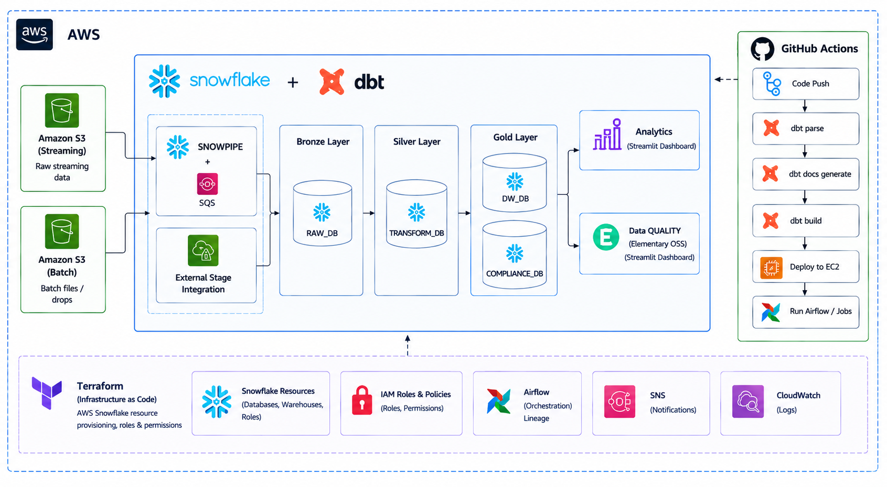

# Trade Data ETL Pipeline

Cloud-native ETL pipeline for daily trade data ingestion, validation, reporting, and access control using Snowflake, dbt, Airflow, Terraform, and GitHub Actions.

---

## dbt Documentation

View the live dbt docs: [dbt Docs](https://ranganathhittanagi.github.io/dws_dataengineering_casestudy/dbt_docs/)

---

## Architecture



The pipeline is deployed on AWS EC2 and orchestrated by Apache Airflow:

1. **GitHub Actions** runs `.github/workflows/dbt-ci.yml` (`dbt deps`, `dbt parse`, `dbt docs generate`) on every PR to `master` and before any deploy.
2. On a push to `master`, `.github/workflows/deploy.yml` first runs the dbt CI job, then deploys the latest code to the `airflow-control` and `dev-ec2-instance` EC2 nodes via SSM Run Command.
3. The EC2 instances bootstrap themselves: they install Docker, clone the repo, fetch runtime secrets from AWS SSM Parameter Store, and start the Airflow stack.
4. Airflow DAGs orchestrate the daily workflow:
   - `trades_raw_etl_dag` waits for a CSV trade file in S3 and runs the dbt raw layer.
   - `trades_transform_etl_dag` cleans, parses, and validates records in the dbt transform layer.
   - `trades_datawarehouse_etl_dag` publishes `valid_trades`, `rejected_trades`, and post-publication audit models.
   - `trades_stream_etl_dag` ingests streaming trade files via Snowpipe.
5. Snowflake stores all trade data across `RAW_DB`, `TRANSFORM_DB`, `DATAWAREHOUSE_DB`, and `COMPLIANCE_DB`.
6. dbt applies Snowflake access controls: dynamic data masking on `COUNTERPARTY` and `NOTIONAL`, and a row access policy on `CURRENCY` driven by a `currency_entitlements` seed.
7. Streamlit dashboards run natively inside Snowsight, and SNS delivers pipeline and infrastructure alerts.

---

## Tech Stack Choices

| Technology | Purpose |
|---|---|
| **Snowflake** | Cloud data warehouse with native stages, `COPY INTO`, dynamic data masking, row access policies, and Streamlit apps |
| **Terraform** | Infrastructure as code for provisioning databases, schemas, roles, users, EC2 instances, IAM roles, S3 buckets, stages, and grants reproducibly |
| **dbt** | SQL-based transformations with incremental materializations, built-in testing, custom `copy_into_table` materialization, and access-control macros |
| **Apache Airflow** | Orchestrates the pipeline (file sensing → dbt run → dbt test) with CeleryExecutor, retries, timeouts, and SNS alerts |
| **Docker** | Containerizes Airflow and all dependencies for consistent local development and deployment |
| **GitHub Actions** | `dbt-ci.yml` validates dbt on PRs and before deploy; `deploy.yml` deploys to EC2 after CI passes |
| **Streamlit in Snowflake** | Serverless dashboard running natively inside Snowflake using Snowpark |
| **AWS SSM Parameter Store** | Stores Snowflake RSA keys and Airflow runtime secrets; nothing sensitive is committed |
| **RSA key-pair auth** | Secure, non-interactive Snowflake access across all components |

---

### AWS Services

| AWS Service | Purpose |
|---|---|
| **Amazon EC2** | Hosts the Airflow control plane (webserver, scheduler, worker, Postgres, Redis) and a dev shell instance |
| **Amazon S3** | Landing zone for batch trade CSV files and streaming trade files ingested by Snowpipe |
| **Amazon SNS** | Delivers pipeline and infrastructure alerts; also receives S3 ObjectCreated events for streaming ingestion |
| **AWS Systems Manager (SSM) Parameter Store** | Securely stores Snowflake RSA keys, Airflow secrets, and runtime configuration values |
| **AWS IAM** | Instance profiles for EC2, trust roles for Snowflake S3 access, and least-privilege policy attachments |
| **Amazon CloudWatch** | Collects Airflow task logs and triggers EC2 instance auto-recovery alarms |
| **Amazon VPC** | Provides the network fabric: VPC, subnets, internet gateway, route tables, and security groups |
| **AWS Application Load Balancer (ALB)** | Routes HTTP traffic to the Airflow webserver on the control EC2 instance |
| **Amazon EBS** | Persistent block storage attached to the Airflow control EC2 instance |
| **AWS KMS** | Encrypts SSM SecureString parameters |

---

## Validation Logic

### Valid Trades

- Trade must have a **non-null** `MATURITY_DATE`
- `MATURITY_DATE` must be **>=** `EXECUTION_DATE`
- Incoming `VERSION` must be **>=** the version already stored for that `TRADE_ID`
- If multiple records arrive for the same `TRADE_ID` in one batch, only the **highest version** is kept
- Status is set to **ACTIVE** if `MATURITY_DATE >= CURRENT_DATE`, otherwise **EXPIRED**
- On every run, all existing rows are re-evaluated — trades transition from ACTIVE to EXPIRED once their maturity date passes

### Rejected Trades

- `MATURITY_DATE` is **NULL** or unparseable → `INVALID_MATURITY_DATE`
- `MATURITY_DATE` is **earlier than** `EXECUTION_DATE` → `MATURITY_BEFORE_EXECUTION`
- Incoming `VERSION` is **lower than** the version already stored → `STALE_VERSION`
- All rejected records are stored with `(SOURCE_TYPE, ROW_ID, RULE_ID, ETL_DATE)` as the composite key

---

## Setup & Execution Guide

### Prerequisites

- AWS account with an IAM user/role that can create EC2, VPC, IAM, S3, SSM, CloudWatch, and SNS.
- Snowflake account with `ACCOUNTADMIN` access.
- Terraform >= 1.5.0, AWS CLI, and Git installed on the deployment host.
- An SSH key pair if you want SSH access to the EC2 instance (SSM access works without one).
- Docker Desktop (only needed for local development).

---

### A. Deploy to AWS EC2 (recommended)

This path provisions the full stack — Snowflake resources, S3 buckets, VPC, EC2 instances, IAM roles, and Airflow secrets — from a single Terraform run. The EC2 instances then self-configure via user-data.

#### 1. Clone the repository

```bash
git clone https://github.com/ranganathhittanagi/dws_dataengineering_casestudy.git
cd dws_dataengineering_casestudy
```

#### 2. Prepare RSA keys and SSM parameters

Authentication uses key-pair auth. Generate the service-user key pair and the Terraform admin key, then store them in SSM Parameter Store.

```bash
# Service user key pair (used by dbt / Airflow at runtime)
openssl genrsa 2048 | openssl pkcs8 -topk8 -inform PEM -out /tmp/dws_service_user.p8 -nocrypt
openssl rsa -in /tmp/dws_service_user.p8 -pubout -out /tmp/dws_service_user.pub

aws ssm put-parameter --name /dws/snowflake/dws-service-user/private_key \
  --type SecureString --value file:///tmp/dws_service_user.p8 --overwrite
aws ssm put-parameter --name /dws/snowflake/dws-service-user/public_key \
  --type SecureString --value file:///tmp/dws_service_user.pub --overwrite

# Terraform admin key (must belong to a Snowflake user with ACCOUNTADMIN privileges)
openssl genrsa 2048 | openssl pkcs8 -topk8 -inform PEM -out /tmp/dws_admin.p8 -nocrypt
aws ssm put-parameter --name /dws/snowflake/admin/private_key \
  --type SecureString --value file:///tmp/dws_admin.p8 --overwrite
```

#### 3. Configure Terraform variables

Create `terraform/terraform.tfvars`. This file is gitignored so it will never be committed.

```hcl
repo_url                = "https://github.com/ranganathhittanagi/dws_dataengineering_casestudy.git"
alert_emails            = ["you@example.com"]
snowflake_user          = "YOUR_SNOWFLAKE_ADMIN_USER"
dev_ssh_public_key_path = "~/.ssh/dws-dev-ec2.pub"
```

Review `terraform/variables.tf` for additional overrides such as `aws_region`, database/schema names, and EC2 instance types.

#### 4. Configure `.env`

Edit the project root `.env` with your account-specific, non-sensitive values:

```bash
SNOWFLAKE_ACCOUNT=YTQEMJI-TW17096
SNOWFLAKE_USER=DWS_SERVICE_USER
SNOWFLAKE_ROLE=DWS_SERVICE_ROLE
SNOWFLAKE_WAREHOUSE=COMPUTE_WH
AWS_REGION=ap-south-1
S3_BUCKET=trades-source-dws
S3_PREFIX=raw/trades
SNOWFLAKE_PARAM_PATH=/dws/snowflake/dws-service-user
```

`deploy/fetch_runtime_env.sh` will pull the non-sensitive `SNOWFLAKE_*` and `S3_*` values from this file on each EC2 deploy. The private key is always fetched from SSM, never from `.env`.

#### 5. Provision with Terraform

```bash
cd terraform
terraform init
terraform plan
terraform apply -auto-approve
cd ..
```

This creates:
- Snowflake databases, schemas, warehouse, roles, users, file formats, stages, and storage integrations.
- S3 buckets for batch and streaming trade files.
- VPC, subnets, security groups, and Application Load Balancer.
- `airflow-control` EC2 instance (Postgres/Redis/Airflow webserver/scheduler/worker) and `dev-ec2-instance` (ad-hoc shell).
- IAM instance profiles so the EC2 nodes can read SSM, S3, and CloudWatch without static AWS credentials.
- SNS topic for alerts and SSM parameters for Airflow secrets.

Both instances automatically clone the repo, run `deploy/fetch_runtime_env.sh`, and start the Docker Compose stack.

#### 6. Access Airflow

```bash
# Airflow URL
terraform output airflow_url

# Initial admin password (also stored in SSM)
aws ssm get-parameter --name /dws/airflow/webserver_admin_password \
  --with-decryption --query Parameter.Value --output text
```

Open the Airflow URL in a browser and log in as `admin` with the retrieved password.

#### 7. Run the DAGs

Generate and upload a sample trade file:

```bash
python src/util_scripts/generate_trades_data.py --date 2026-08-15 --rows 100
aws s3 cp data/trades_2026-08-15.csv s3://${S3_BUCKET}/${S3_PREFIX}/trades_2026-08-15.csv
```

In the Airflow UI:
1. Unpause `trades_raw_etl_dag`, `trades_transform_etl_dag`, and `trades_datawarehouse_etl_dag`.
2. Trigger `trades_raw_etl_dag` for `2026-08-15`.
3. After it succeeds, trigger `trades_transform_etl_dag` and `trades_datawarehouse_etl_dag` for the same date.

The streaming DAG (`trades_stream_etl_dag`) runs automatically when files land in the streaming S3 bucket.

#### 8. Verify data and access controls in Snowflake

```sql
SELECT * FROM DATAWAREHOUSE_DB.DATAWAREHOUSE_SCHEMA.VALID_TRADES;
SELECT * FROM COMPLIANCE_DB.COMPLIANCE_SCHEMA.REJECTED_TRADES;

SHOW MASKING POLICIES IN COMPLIANCE_DB.ACCESS_CONTROL;
SHOW ROW ACCESS POLICIES IN COMPLIANCE_DB.ACCESS_CONTROL;
```

---

### Troubleshooting

- If `terraform apply` fails because the `EC2ActionsAccess` IAM role already exists, import it first:
  ```bash
  terraform import aws_iam_role.ec2_actions EC2ActionsAccess
  ```
- If Airflow tasks fail to connect to Snowflake, check that the SSM parameters exist and that `deploy/fetch_runtime_env.sh` ran during bootstrap. View the log on the instance:
  ```bash
  aws ssm start-session --target $(terraform output -raw control_instance_id)
  sudo tail -n 200 /var/log/bootstrap.log
  ```
- To run ad-hoc dbt commands, connect to the dev instance and use the container:
  ```bash
  docker compose -f deploy/docker-compose.dev.yml exec dev-shell /usr/local/bin/dbt --version
  ```

---

## CI/CD with GitHub Actions

Two workflows drive the repo:

- **`.github/workflows/dbt-ci.yml`**: Runs on PRs to `master` and as a reusable workflow. It installs `dbt-snowflake`, loads non-sensitive settings from `.env`, fetches the Snowflake private key from SSM, and runs `dbt deps`, `dbt parse`, and `dbt docs generate`.
- **`.github/workflows/deploy.yml`**: Triggered on pushes to `master`. It runs the dbt CI job first; only if CI succeeds does it start the EC2 instances and deploy the latest code via SSM Run Command.

**Required GitHub secrets** (Settings → Secrets → Actions):

| Secret | Value |
|---|---|
| `AWS_ACCESS_KEY_ID` | IAM user access key with EC2, SSM, SNS, and CloudWatch permissions |
| `AWS_SECRET_ACCESS_KEY` | Corresponding secret key |

Snowflake credentials are fetched from SSM during CI, so no Snowflake secrets need to be stored in GitHub.

---

## Verification Checks

- `terraform plan` and `terraform apply` complete without errors.
- `terraform output airflow_url` returns the Airflow web URL.
- `aws ssm start-session --target $(terraform output -raw control_instance_id)` connects to the control node.
- Airflow DAGs complete all tasks (green).
- Snowflake shows `VALID_TRADES`, `REJECTED_TRADES`, and access-control policies under `COMPLIANCE_DB.ACCESS_CONTROL`.
- `dbt debug` reports `Connection test: OK` when run inside the container.
- No passwords or private keys are committed to git.
